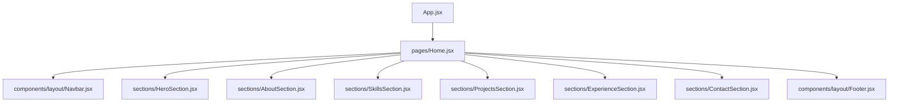

# Portfolio Structure Plan

This document describes the current project layout and the planned finished structure for the portfolio.

## Current Direction

The app is being organized around a simple page composition model:

- `App.jsx` acts as the application shell.
- `pages/` owns page-level composition.
- `sections/` contains the major scrollable blocks on the page.
- `components/layout/` contains shared framing elements.
- `components/ui/` contains reusable presentational pieces.
- `data/` stores content and profile information.
- `assets/` stores images, icons, and the resume.

## Planned Structure

```text
src/
├── components/
│   ├── layout/
│   │   ├── Navbar.jsx
│   │   ├── Footer.jsx
│   │   └── Container.jsx
│   └── ui/
│       ├── SectionTitle.jsx
│       ├── TechBadge.jsx
│       ├── SkillCard.jsx
│       ├── ProjectCard.jsx
│       ├── ExperienceCard.jsx
│       └── SocialButton.jsx
├── sections/
│   ├── HeroSection.jsx
│   ├── AboutSection.jsx
│   ├── SkillsSection.jsx
│   ├── ProjectsSection.jsx
│   ├── ExperienceSection.jsx
│   └── ContactSection.jsx
├── data/
│   ├── profile.js
│   ├── projects.js
│   ├── skills.js
│   ├── experience.js
│   └── socials.js
├── assets/
│   ├── images/
│   ├── icons/
│   └── resume/
├── pages/
│   └── Home.jsx
├── App.jsx
├── main.jsx
└── index.css
```

## Visual Page Flow



## Responsibility Split

- `layout/` handles shared structure, spacing, and navigation.
- `ui/` handles reusable cards, badges, and buttons.
- `sections/` handles full page sections and ordering.
- `data/` keeps content outside of components so it is easier to update.
- `pages/` assembles the full page from sections.

## Notes For This Repo

- The current `Navbar.jsx` and `HeroSection.jsx` already match the direction of this structure.
- `ProjectSection.jsx` should be renamed to `ProjectsSection.jsx` if you want naming consistency with the rest of the sections.
- The next useful step is to move page composition into `pages/Home.jsx` and keep `App.jsx` minimal.